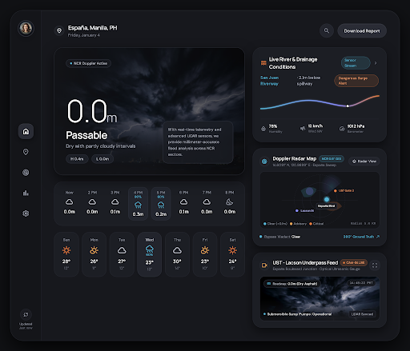
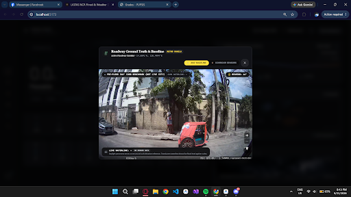

# LIGTAS METRO

Metro Manila Flood-Safe Commute & Bypass Radar. Real-time flood monitoring, passability analysis, MapLibre GL spatial hazard overlays, and ground-truth 360° corridor street views powered by Mapillary.

> [!WARNING]
> **Safety Disclaimer**: LIGTAS METRO is an informational and decision-support tool designed to assist commuters and fleet operators. Flood inundation depth readings, weather conditions, river discharge forecasts, and road passability assessments are subject to telemetry latency, sensor availability, and mathematical model limitations. Never attempt to drive or walk through flooded roadways, and never disregard warnings or evacuation directives issued by official disaster management authorities (NDRRMC, PAGASA, MMDA, or local LGUs). Do not rely on this application for life-safety critical decisions.

---

## Preview

| Dashboard & Doppler Radar | Ground-Truth Corridor View |
| :---: | :---: |
|  |  |

---

## Features

- **Dynamic Hazard & Telemetry Matrix**: Road inundation depth metrics, rainfall rate, and vehicle passability assessments (Sedans, SUVs/4x4s, Pedestrians). See [Passability & Vehicle Depth Documentation](docs/PASSABILITY.md).
- **MapLibre GL Interactive Radar**: Vector basemap with flood hazard polygons across Metro Manila corridors (España, Sta. Mesa, Araneta, Taft, Katipunan, and dynamic search for any Philippine location).
- **Dual-Mode Street Viewer Modal**:
  - **Ground-Truth 360° (Mapillary)**: Interactive 360-degree street-level imagery with compass bearing and spatial node navigation.
  - **Corridor Sensor Telemetry**: River gauges (Marikina Sto. Niño, Pasig River, Manggahan Floodway) and rainfall trend sparklines.
- **Dynamic Geocoding Search**: OpenStreetMap Nominatim integration restricted to the Philippines (PAR bounds).

---

## Data Sources

In accordance with transparent data reporting principles, every telemetry layer and data provider in LIGTAS METRO is classified by its operational tier:

| Source / Provider | Data Provided | Operational Classification | Update Cadence / Notes |
| :--- | :--- | :--- | :--- |
| **Open-Meteo Weather API** | Ambient temperature, surface pressure, relative humidity, wind speed, precipitation probability, hourly forecast | **Live** | Synoptic updates queried per corridor coordinates (`api.open-meteo.com`). |
| **Open-Meteo Flood API (GLoFAS)** | River discharge rate estimates (\(m^3/s\)) for the Pasig-Marikina catchment basin | **Modeled / Forecast** | Hydrological simulation derived from global runoff models. |
| **MapLibre GL Basemap** | High-contrast vector basemap tiles | **Live Tiles** | Carto / OpenStreetMap vector tile servers. |
| **Mapillary API** | Street-level 360° panoramic imagery and compass bearings | **Live / Cached Photometric** | Fetched via Mapillary v4 API (`graph.mapillary.com`) using corridor coordinate proximity search. |
| **OpenStreetMap Nominatim** | Search geocoding restricted to Philippine bounds | **Live Geocoding** | Debounced queries with custom user-agent identification. |
| **Corridor Inundation Matrix** | Water depth estimates and vehicle clearance passability (España, Taft, Araneta, Sta. Mesa, Katipunan) | **Modeled / Simulated** | Heuristic passability rules based on rainfall accumulation and historical flood stage baselines. |
| **Hydrological Stations** | Sto. Niño Marikina river levels, Manggahan sluice gate status, Pasig River discharge | **Simulated Reference Stations** | Calibrated against official alert thresholds (15m Alert, 16m Alarm, 18m Evacuate). |

---

## Tech Stack

- **Frontend**: React 19, Vite, Tailwind CSS
- **Mapping & GIS**: MapLibre GL, Mapillary JS
- **Icons**: Lucide React
- **Design System**: LIGTAS Velvet Console (High-contrast dark instrument aesthetic)

---

## Getting Started

1. Clone the repository:
   ```bash
   git clone https://github.com/a-ldnstntng/LIGTAS.git
   cd LIGTAS
   ```

2. Install dependencies:
   ```bash
   npm install
   ```

3. Configure environment variables:
   Copy `.env.example` to `.env` and supply your Mapillary client token:
   ```env
   VITE_MAPILLARY_CLIENT_TOKEN=your_token_here
   ```

4. Start the development server:
   ```bash
   npm run dev
   ```

5. Build for production:
   ```bash
   npm run build
   ```

---

## License

This project is licensed under the MIT License - see the [LICENSE](LICENSE) file for details.
